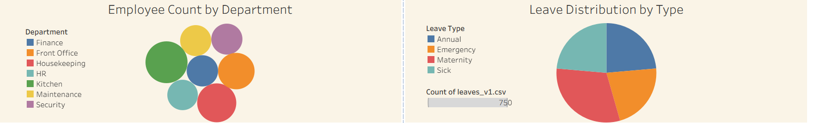
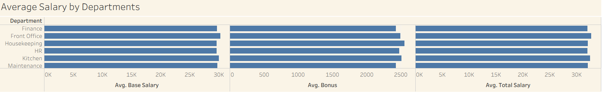
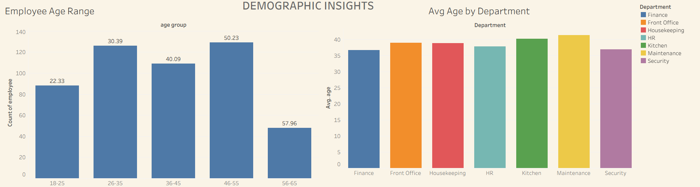

#  Hotel HR & Finance Dashboard Project

This project presents an end-to-end data analysis workflow for a fictional hotel. It includes data cleaning with Python (Pandas), SQL queries on PostgreSQL, and interactive dashboards built using Tableau. The focus is on **Human Resources** and **Financial** metrics.

---

## 📁 Project Structure

```
Hotel-Data-Analytics/
│
├── data/       # Raw and cleaned datasets (CSV)
├── sql/        # PostgreSQL queries for analysis
├── eda/        # Exploratory Data Analysis in Jupyter notebooks
├── images/     # Tableau dashboard screenshots and charts
├── tableau/    # Tableau packaged workbooks (.twb / .twbx)
└── README.md   # Project documentation
```


---

## 🎯 Objectives

- Provide key HR insights like leave behavior, employee age & gender distribution.
- Analyze salary structure and detect department-level trends.
- Build interactive dashboards for decision-makers such as HR Managers and CFOs.

---

## 📊 Dashboards Overview

### 1️⃣ Employee Leave Overview Dashboard
**Visualizations:**
- ✅ Total Leaves by Department
- ✅ Employee Count per Department
- ✅ Leave Status (Approval / Rejection)
- ✅ Leave Distribution by Type
- ✅ Average Age by Department
- ✅ Gender Distribution by Department

📷 **Preview:**



---

### 2️⃣ Finance & Compensation Dashboard
**Visualizations:**
- ✅ Average Salary Breakdown (Base, Bonus, Total)
- ✅ Salary Composition by Department
- ✅ Highest Paid Employees

📷 **Preview:**



---

### 3️⃣ Demographic Insights Dashboard
**Visualizations:**
- ✅ Age Range of Employees
- ✅ Average Age
- ✅ Gender and Age Distribution by Department

📷 **Preview:**



---

## 🧹 Data Cleaning & Processing

- Done using **Python (Pandas)** in `eda/` folder
- Removed duplicates, nulls, fixed date errors 
- Generated leave days and calculated salary columns
- Created additional features like `total_salary`, `age`, and `leave_days`

---

## 🛢️ SQL Analysis

- Written in **PostgreSQL**
- Used for slicing data, aggregations, and joins
- Scripts can be found in the `sql/` folder

---

## 📈 Tools & Tech

- **Tableau** – Dashboards
- **PostgreSQL** – SQL queries
- **Pandas** – Data cleaning and transformation
- **Jupyter Notebook** – EDA & preprocessing
- **Mockaroo** – Synthetic data generation (HR & Finance datasets)

---

## 🚀 Future Work

- Add loyalty program analysis for long-term customers
- Integrate revenue & occupancy trends
- Real-time alert system for incorrect data entries
- Export dashboards to web using Tableau Public

---

## 🧠 Author

**Ersin Tepegöz**  
📧 tepegozersin@gmail.com  

---

## 📌 Note

All data is synthetically generated and does not represent real individuals or businesses.

